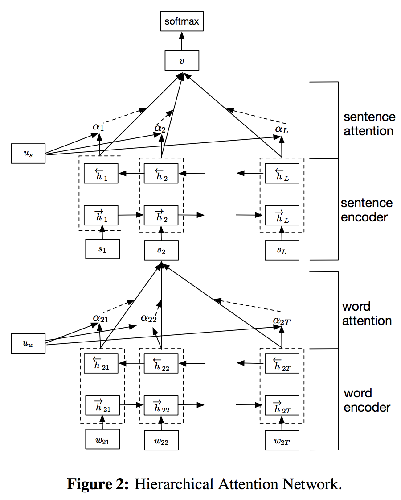
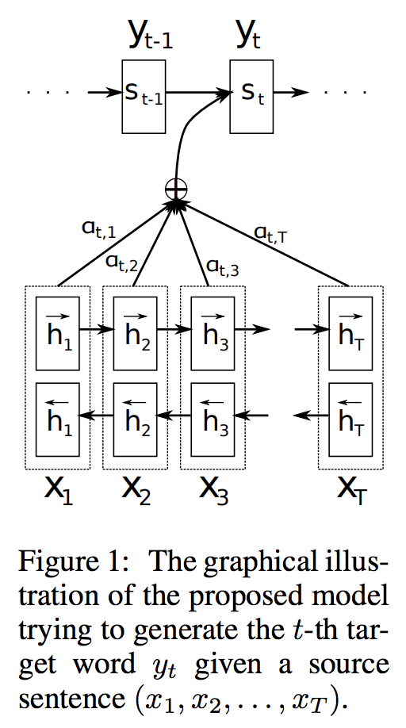
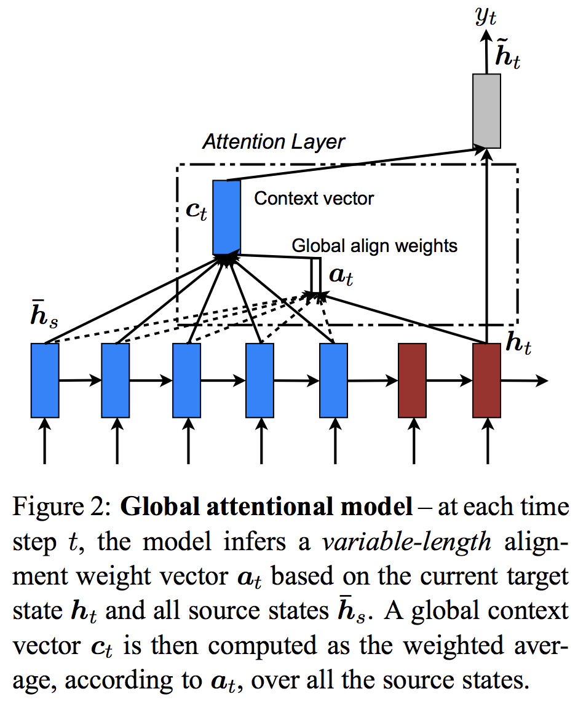
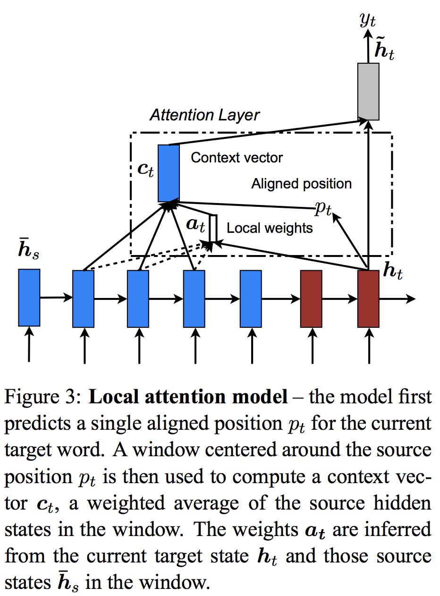

## Attention Mechanism
[to be continued]  
A collection of Tensorflow implementation for various attention mechanism.
It includes:
- [Hierarchical Attention Networks for Document Classification](http://www.aclweb.org/anthology/N16-1174), Zichao Yang et al. 
  <figure class="half">
  
  
  </figure>
- Seq2Seq + Attention, including: 
  - [Additive Attention/BahdanauAttention](https://arxiv.org/abs/1409.0473), Dzmitry Bahdanau et al.
  - [Multiplicative Attention/LuongAttention](https://arxiv.org/abs/1508.04025), Minh-Thang Luong et el. 
  <figure class="half">
  
  
  </figure>
## Prerequisites
 - TensorFlow 1.4.0
 - Python 2.7
 - tqdm
 - Keras 2.2.4
 - numpy 1.16.3

